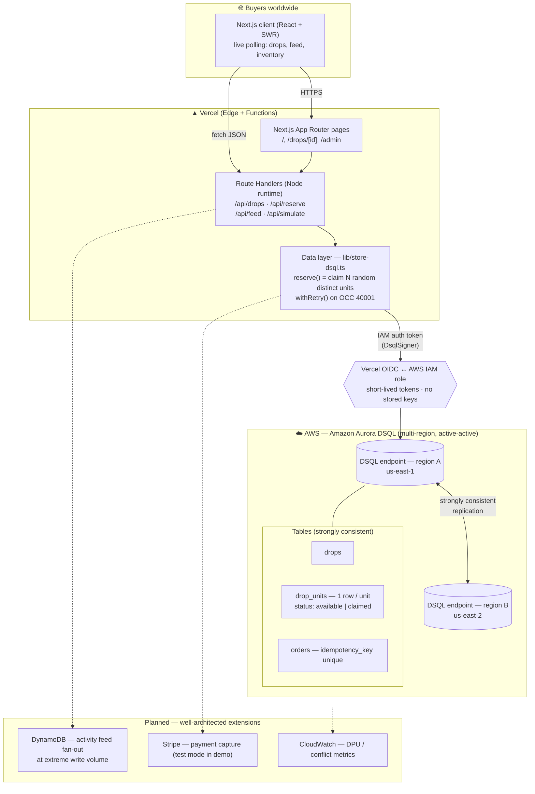

# DropZero — Architecture

## System diagram

> The dashed boxes are the "we know what comes next" extensions judges look for —
> not built for the demo, but the path to production is intentional.

## Why each piece

| Component | What it is | What it does |
|---|---|---|
| Next.js client | React SPA on Vercel | Renders drops; polls inventory/feed every ~1.2s for a live feel |
| Route Handlers | Next.js API (Node runtime) | Stateless endpoints; `pg` needs Node (not Edge) runtime |
| `store-dsql.ts` | The data layer | Claims random distinct units in one strongly-consistent txn |
| Vercel OIDC → IAM | Keyless auth | Vercel assumes an AWS role; `DsqlSigner` mints per-connection tokens |
| Aurora DSQL | Serverless distributed SQL | Strongly-consistent, multi-region active-active inventory of record |
| `drop_units` | Discrete inventory rows | Spreads writes across keys → OCC-friendly → no oversell, low conflict |
| `orders` | Order ledger | `idempotency_key` unique index makes retries safe |

## The data model (and why it's DSQL-shaped)

- **No single counter.** `remaining` is derived from `COUNT(drop_units WHERE
  status='available')`, never a hot decremented row. This is the core anti-OCC-
  contention decision.
- **No foreign keys / JSON / triggers.** DSQL doesn't support them; `orders.drop_id`
  and `drop_units.drop_id` are logical references enforced in code.
- **Primary keys inline; async secondary indexes.** `db/init.ts` auto-rewrites
  `CREATE INDEX` → `CREATE INDEX ASYNC` when it detects a DSQL endpoint.
- **Batched mints under the 10k-rows/transaction limit** (500 units per insert).

## Concurrency guarantee

Each `drop_units` row transitions `available → claimed` at most once, in a
strongly-consistent transaction. Therefore `claimed ≤ total` always holds —
**overselling is impossible by construction**, independent of region, traffic, or
retries. Conflicts (`40001`) only occur when two buyers race for the *same* random
row; random targeting makes that rare, and `withRetry` resolves it transparently.

## Well-Architected notes (for the diagram callouts)

- **Reliability:** multi-AZ within a region (DSQL replicates across 3 AZs) + active-
  active across regions; automatic failover, no single write bottleneck.
- **Security:** no stored credentials (OIDC + short-lived IAM tokens); secrets only
  in Vercel env; public repo never holds keys.
- **Performance:** writes spread across the key range; reads served from the nearest
  regional endpoint.
- **Cost:** serverless, scales to zero; pay per DPU + GB-month; the simulator is
  capped (≤5,000 buyers) to bound demo spend.
- **Operational excellence:** idempotency keys, transparent retries, derived counts
  instead of brittle counters.

## Exporting the Devpost diagram (PNG required)

Devpost wants an image. Quickest path:
1. Open <https://app.diagrams.net> (draw.io) → enable the **AWS 2025** icon shape
   library (More Shapes → Networking → AWS).
2. Recreate the three groups above: **Buyers → Vercel (pages, API, data layer) →
   AWS (Aurora DSQL multi-region + tables)**, with the OIDC arrow between Vercel and
   AWS. Use the official Aurora DSQL and Vercel icons.
3. Label every box with *what it is* and *what it does*; arrows show call direction.
4. **File → Export as → PNG** (or SVG) and attach to the submission.

(You can paste the Mermaid above into <https://mermaid.live> for a fast first draft
to trace over.)
